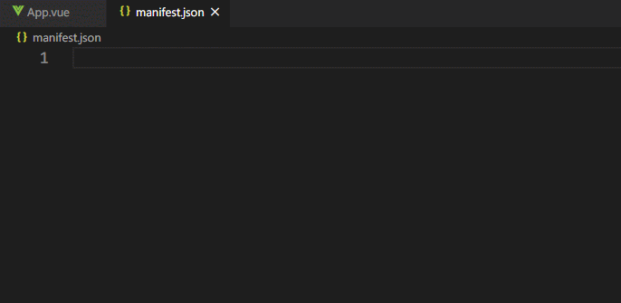
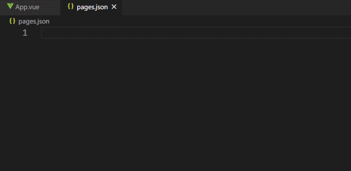
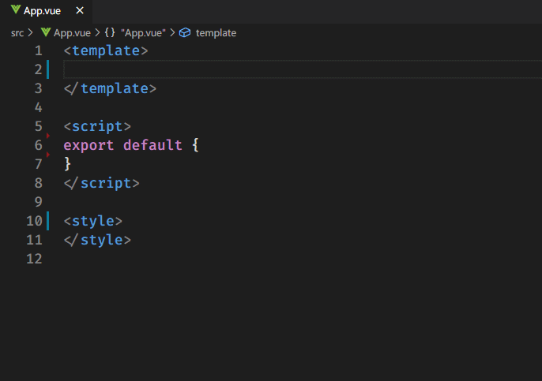
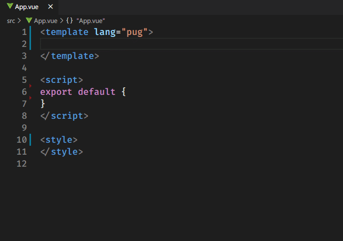
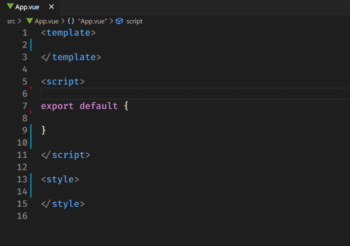
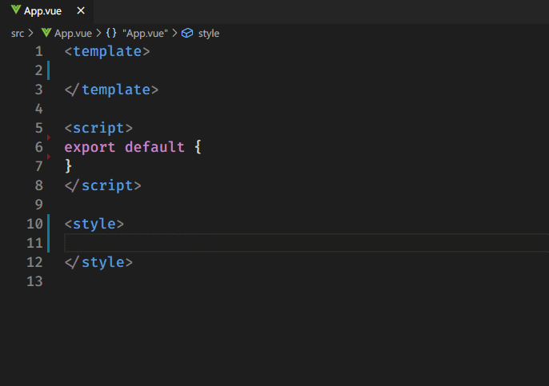
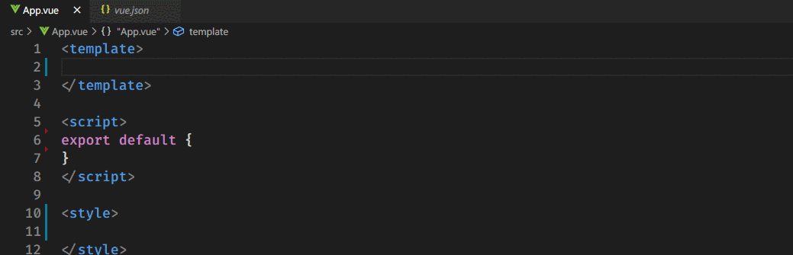
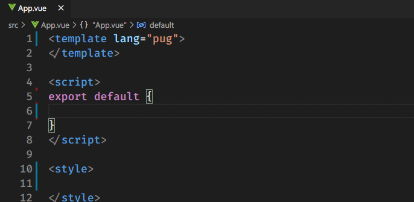
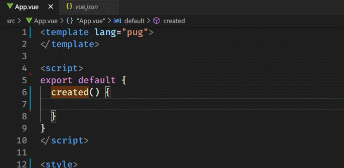

# Uniapp Enhanced

## Features

- Code snippets for .vue files with uniapp template/script/style.
- Schemas for manifest.json and pages.json.
- Conditional compilation comments snippets for html/pug/js/ts/css/stylus/less/sass/scss in vue files.

## Supported languages

- Vue

## Usage

### **Schemas**

> manifest.json

> pages.json

### **Conditional Compilation Comments**

> html

> pug

> js/ts

> css

> stylus/less/sass/scss

### **Code Snippets**

> Uniapp Components

> Uniapp Apis

## Based On

- [vetur](https://github.com/vuejs/vetur)

**Enjoy!**
